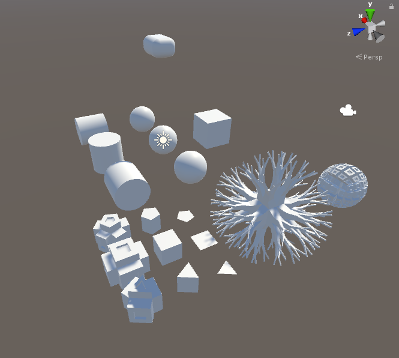

# Plasticine
Procedural Mesh generation framework for Unity

Can be used to create geometry in editor mode or in game mode.
Vertices can be shared or not. Normals are smoothed depending on a limit angle.

## Limitations
UV Mapping is not easy to handle in procedural geometry. This projet has a way to use it, you may find it painfull. 

## Code Usage
Can be used directly in Unity, or via a dll built in a separate project (project not provided). MonoDevelop can do that very well.

## Tests
Core classes have unit tests (NUnit)
Some Unity test scenes are provided
